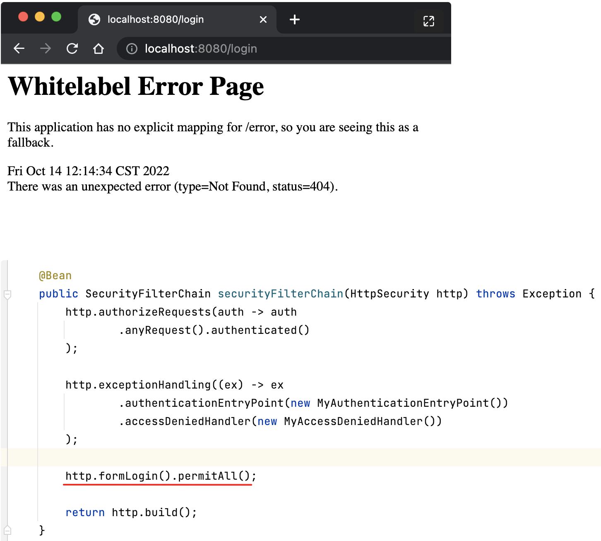
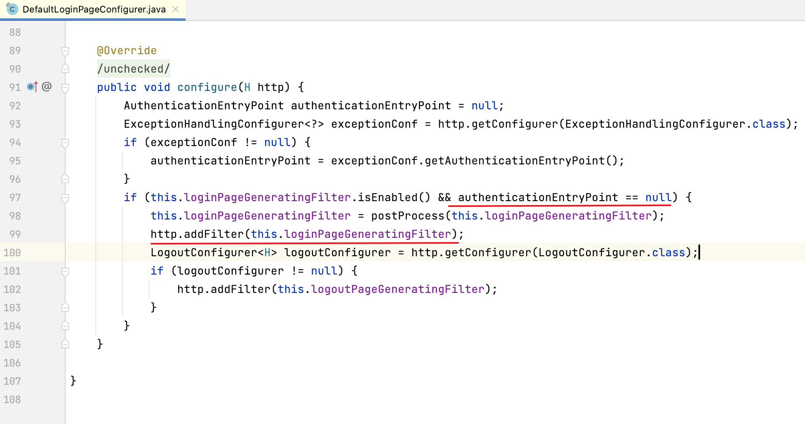
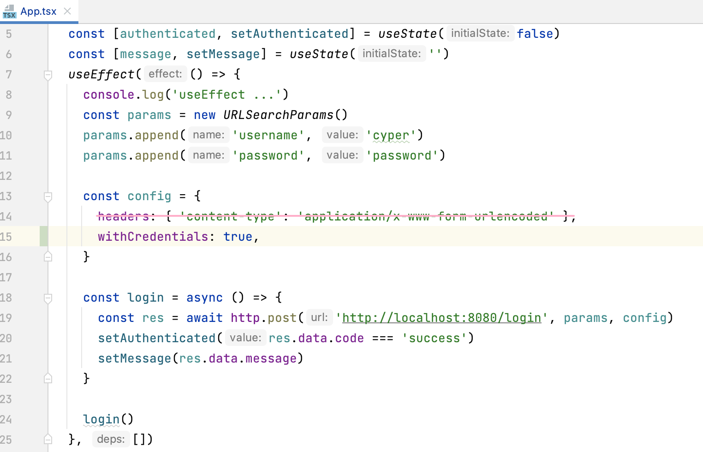
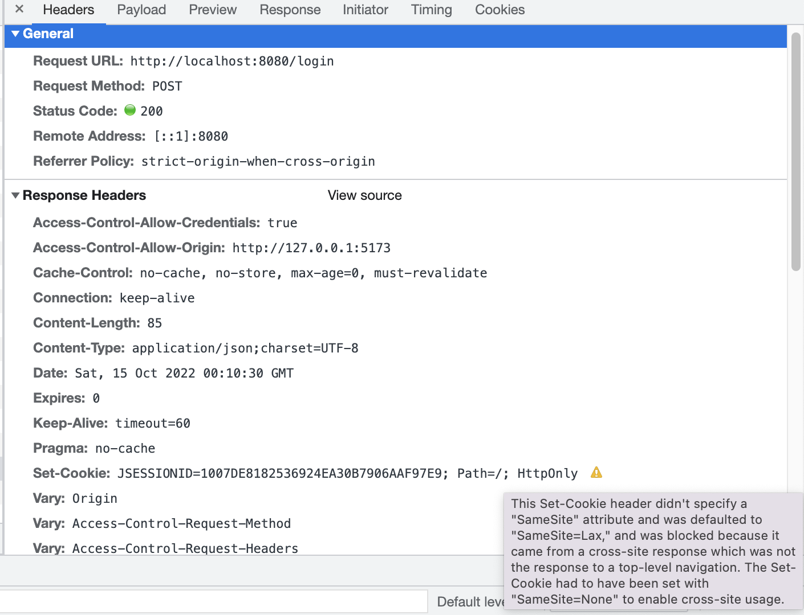

## Environment

- Java 17

## Check point

- [x] Check we can invoke spring security formLogin endpoint via axios
- [ ] Check axios will write JSESSIONID back to browser cookie automatically
- [ ] Check axios will write csrf-token to browser automatically
- [ ] Custom login page( SURPRISE! )

## formLogin的坑

为什么直接访问 http://localhost:8080/login 返回404?

The seemingly irrelevant part `http.exceptionHandling` and ` http.formLogin` are correlated.

If you configured `authenticationEntryPoint` in exceptionHandling, spring security will not generate default login page
for you (event if you have http.formLogin() configured!)

相关的源代码:

### Solution #1 - provide custom login page

We have to provide our own custom login page. Check [here](https://www.youtube.com/watch?v=yoTohM2jYhs) for how to do
that.

1. Change SecurityConfig: `http.formLogin(login -> login.loginPage("/login").permitAll());`
2. Provide a LoginController.
3. Provide templates/login.html
4. Add thymeleaf to pom.xml(This is required becoz any string returned from your controller will be regarded as some
   template, so you need to provide some template engine to support it, otherwise, you will get http `500` error.
   > Circular view path [login]: would dispatch back to the current handler URL [/login] again. Check your ViewResolver
   setup! (Hint: This may be the result of an unspecified view, due to default view name generation.)6)
   at org.springframework.web.servlet.FrameworkServlet.doGet(FrameworkServlet.java:898)

### Solution #2 - do nothing

As we use single page application, the login page(from backend) is not required, we can leave it alone, just
use `POST /login` endpoint and don't use `GET /login` at all.

## CORS的坑

CORS 必须放在spring security filterChain之前。

Spring Framework provides first class support for CORS. CORS must be processed before Spring Security because the
pre-flight request will not contain any cookies (i.e. the JSESSIONID). If the request does not contain any cookies and
Spring Security is first, the request will determine the user is not authenticated (since there are no cookies in the
request) and reject it.

- 不使用security， 使用 `@CrossDomain` 在Controller类/或方法上 设置CORS
- 不使用security， 可以在 `WebMvcConfigurer#CorsRegistry` 全局设置CORS
- 使用Spring Security, 声明名为`CorsConfig#corsConfigurationSource`的Bean，并在`SecurityConfig#http.cors(withDefaults())`
  全局设置CORS
- ‼️127.0.0.1 和 localhost 是 **不同的cors origin**
- CorsConfig使用通配符配置多个origin， `config.setAllowedOriginPatterns(List.of("http://127.0.0.1:[*]"));`
- CORS的文档(without spring
  security): https://docs.spring.io/spring-framework/docs/current/reference/html/web.html#mvc-cors
- CORS的文档(with spring security): https://docs.spring.io/spring-security/reference/servlet/integrations/cors.html

## Axios 的 坑

Axios的content-type 随data参数的类型动态变化。

When sending POST requests (also PUT and PATCH requests) with Axios, note how we pass a normal Javascript object as
data. Axios converts this Javascript data to JSON by default. It also sets the “content-type” header to
`application/json`.

However, if you pass a serialized JSON object as data, Axios treats the content type as
`application/x-www-form-urlencoded` (form-encoded request body). If the intended content type is JSON, you have to
manually set the header using the `headers` config option.

比如，`axios.post(url, data)`

当data是使用`URLSearchParams`或`qs.stringify(json)`系列化数据时，
content-type自动变为`'application/x-www-form-urlencoded`， 如果向下面这样重复指定content-type，观察chrome的network请求，
发现content-type变成了一个奇怪的值 -- 重复了两遍， (我觉得这是axios的bug!) 结果导致username无法从后台获取到，
解决办法时删除划线的那一行代码。

当data是json object类型时，axios的content-type值为 `application/json`

当data时FormData类型时， 可以使用`axios.postForm(..)`方法

结论: 使用axios时， 绝大多数情况下都不要自己折腾 content-type.

## Cookie 的坑

- 目的是验证 checkpoint #2
- cookie domain不看port， 也就是说 不同port相同domain的应用 会共享cookie。
- 也就是说: `localhost:3000` 和 `localhost:8080` 是 **相同的cookie domain**, **不同的cors origin**

可以看到axios的response header中已经包含了 `Set-Cookie`

但是浏览器阻止跨域设置cookie， 见下图中的popup

解决办法: https://stackoverflow.com/a/64202472/2497876

