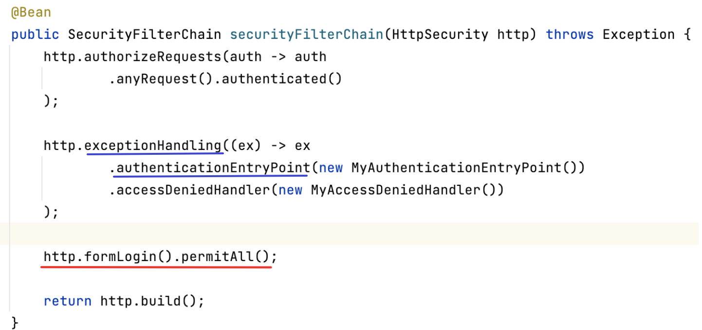
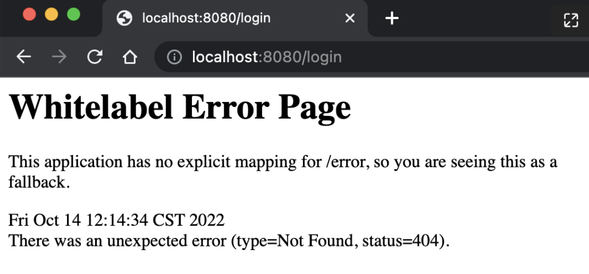
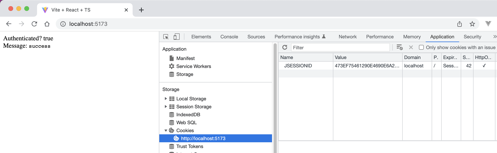
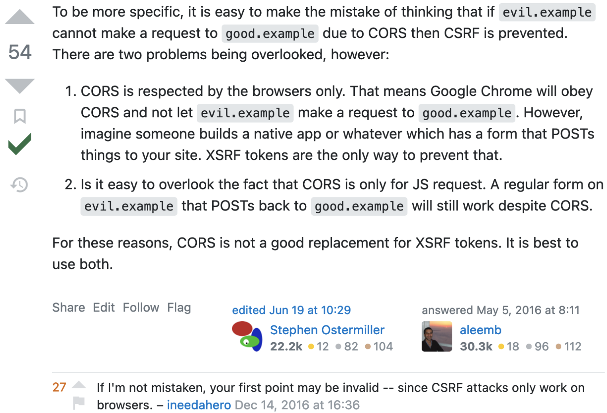

## Environment

- Java 17

## Check point

- [x] Check we can invoke spring security formLogin endpoint via axios
- [x] Check axios will write JSESSIONID back to browser cookie automatically
- [ ] Check axios will write csrf-token to browser automatically
- [x] Custom login page( SURPRISE! )

## CSRF测试

### csrf attack

- 启动根项目，端口8080
- 启动frontend目录下的vite项目(good.com）, 访问http://localhost:5173/, 确保admin处于登录状态
- 启动evil目录下的项目，端口8888， 修改/etc/hosts, 加入evil.com 127.0.0.1
- 访问http://evil.com:8888, 观察Console: evil user created

### protect csrf

- 打开根项目中的SecurityConfig, 注释掉 `http.csrf().disable()`
- 重启根项目，访问http://evil.com:8888, 观察Console:

## formLogin的坑

给定如下Spring Security的config代码:


为什么直接访问 http://localhost:8080/login 返回404?


结论：在exceptionHandling中设置 authenticationEntryPoint 会阻止 spring security生成login页面， 所以报404

The seemingly irrelevant part `http.exceptionHandling` and ` http.formLogin` are correlated.

If you configured `authenticationEntryPoint` in exceptionHandling, spring security will not generate default login page
for you (event if you have http.formLogin() configured!)

相关的源代码:


### Solution #1 - provide custom login page

We have to provide our own custom login page. Check [here](https://www.youtube.com/watch?v=yoTohM2jYhs) for how to do
that.

1. Change SecurityConfig: `http.formLogin(login -> login.loginPage("/login").permitAll());`
2. Provide a LoginController.
3. Provide templates/login.html
4. Add thymeleaf to pom.xml(This is required becoz any string returned from your controller will be regarded as some
   template, so you need to provide some template engine to support it, otherwise, you will get http `500` error.
   > Circular view path [login]: would dispatch back to the current handler URL [/login] again. Check your ViewResolver
   setup! (Hint: This may be the result of an unspecified view, due to default view name generation.)6)
   at org.springframework.web.servlet.FrameworkServlet.doGet(FrameworkServlet.java:898)

### Solution #2 - do nothing

As we use single page application, the login page(from backend) is not required, we can leave it alone, just
use `POST /login` endpoint and don't use `GET /login` at all.

## CORS的坑

- CorsFilter 必须放在spring security之前， 不然preflight请求会返回403。
- ‼️127.0.0.1 和 localhost 是 **不同的cors origin**

Spring Framework provides first class support for CORS. CORS must be processed before Spring Security because the
pre-flight request will not contain any cookies (i.e. the JSESSIONID). If the request does not contain any cookies and
Spring Security is first, the request will determine the user is not authenticated (since there are no cookies in the
request) and reject it.

- 非spring security项目， 使用 `@CrossDomain` 在Controller类/或方法上 设置CORS
- 非spring security项目， 可以在 `WebMvcConfigurer#CorsRegistry` 全局设置CORS
- spring security项目, declare名为`CorsConfig#corsConfigurationSource`
  的Bean，并在`SecurityConfig#http.cors(withDefaults())` 全局设置CORS
- CorsConfig使用通配符配置多个origin， `config.setAllowedOriginPatterns(List.of("http://127.0.0.1:[*]"));`
- CORS的文档(without spring
  security): https://docs.spring.io/spring-framework/docs/current/reference/html/web.html#mvc-cors
- CORS的文档(with spring security): https://docs.spring.io/spring-security/reference/servlet/integrations/cors.html

## Axios 1.x 的 坑

- package.json中的axios突然变成1.x 很不习惯，原来 axios 在2022.10从万年的 0.x 一跃变成1.x， 带来诸多breaking change
- Axios的content-type 现在随data参数的类型动态变化
- 使用axios时， 绝大多数情况下都不要自己折腾 content-type.

When sending POST requests (also PUT and PATCH requests) with Axios, note how we pass a normal Javascript object as
data. Axios converts this Javascript data to JSON by default. It also sets the “content-type” header to
`application/json`.

However, if you pass a serialized JSON object as data, Axios treats the content type as
`application/x-www-form-urlencoded` (form-encoded request body). If the intended content type is JSON, you have to
manually set the header using the `headers` config option.

比如，`axios.post(url, data)`

当data是使用`URLSearchParams`或`qs.stringify(json)`系列化数据时，
content-type自动变为`'application/x-www-form-urlencoded`， 如果向下面这样重复指定content-type，观察chrome的network请求，
发现content-type变成了一个奇怪的值 -- 重复了两遍， (我觉得这是axios的bug!) 结果导致username无法从后台获取到，
解决办法时删除划线的那一行代码。


当data是json object类型时，axios的content-type值为 `application/json`

当data时FormData类型时， 可以使用`axios.postForm(..)`方法

结论: 使用axios时， 绝大多数情况下都不要自己折腾 content-type.

## Cookie 的坑

- 目的是验证 checkpoint #2
- cookie domain不看port， 也就是说 不同port相同domain的应用 会共享cookie。
- 也就是说: `localhost:3000` 和 `localhost:8080` 是 **相同的cookie domain**, **不同的cors origin**

可以看到当用 http://127.0.0.1:5173 访问前端时， axios的response header中已经包含了 `Set-Cookie`

但是浏览器阻止跨域设置cookie， 见下图中的popup. (原因是localhost和127.0.0.1不是相同的domain）


最简单的办法是使用 http://localhost:5173/ 访问前端（这样localhost:8080和localhost:
5173就是相同的cookie domain啦)



另外可以参考: https://stackoverflow.com/a/64202472/2497876

## CSRF

`Cross-Origin Resource Sharing` and  `Cross-Site Request Forgery`

这个cross让我心生疑问: 如果合理的设置cors，不允许跨域请求是不是就可以阻止csrf? 答案是否定的。

直接上图（https://stackoverflow.com/questions/19793695/does-a-proper-cors-setup-prevent-csrf-attack）



假设你用admin登录了good.com, 你打开了某个evil.com钓鱼站点， 该站点使用了一个隐藏的form表单通过post请求创建了一个新用户。
然后他就可以用这个偷偷摸摸创建的新用户登录你的站点了。 这是因为CORS设置只影响通过js发起的ajax请求，CORS会对preflight做检查和限制，
,但是evil.com不是通过js请求发起创建用户请求的，该请求将会被正常执行。

验证checkpoint 1时 `GET /login`直接报csrf的错误，
所以我一开始就设置了`http.csrf(csrf -> csrf.ignoringAntMatchers("/login"));`, 原因很简单，GET请求不太需要csrf.

## Spring Boot CSRF attack真困难

### 1. 首先form必须使用application/json

但是html form的enctype属性无法设置为`application/json`（即使设置了也会被忽略）

```
Resolved [org.springframework.web.HttpMediaTypeNotSupportedException: Content type 'application/x-www-form-urlencoded;charset=UTF-8' not supported]
```

```bash
curl -i -X POST -d "username=xx&passwod=yy" http://localhost:8080/admin/user
HTTP/1.1 415
Accept: application/json, application/*+json

{"timestamp":"2022-10-15T03:38:29.709+00:00","status":415,"error":"Unsupported Media Type","path":"/admin/user"}%
```

通过js脚本? https://github.com/keithhackbarth/submitAsJSON, 我尝试了不好用!

我提了一个issue:https://github.com/keithhackbarth/submitAsJSON/issues/2

通过Flash？ [Exploiting CSRF on JSON endpoints with Flash and redirects](https://blog.appsecco.com/exploiting-csrf-on-json-endpoints-with-flash-and-redirects-681d4ad6b31b)

### 2. evil.com不能使用iframe

错误: Refused to display 'http://localhost:8080/' in a frame because it set 'X-Frame-Options' to 'deny'.

不成功的代码：

```html

<iframe style="display:none" name="csrf-frame"></iframe>

<form target="csrf-frame" action="http://localhost:8080/admin/user" method="post"
      enctype="application/json">
    <input name="username" type="hidden" value="evil-user">
    <input name="password" type="hidden" value="evil-password">
</form>

<script>
    document.forms[0].submit()
</script>
```

这是因为good.com的默认response header中包含 `X-Frame-Options: DENY`


